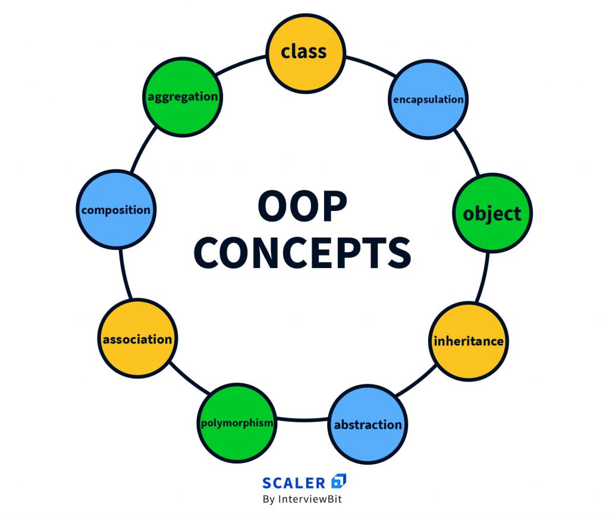

Object-Oriented Programming (OOP) is a programming paradigm that revolves around the concept of objects. In OOP, objects are instances of classes,
and these objects can contain both data (attributes or properties) and methods (functions or procedures). The primary methodologies in OOP are encapsulation,
inheritance, polymorphism, and abstraction:

# Definitions:
### Object:
An instance of a class. It has its own state (attributes) and behavior (methods).
### Class:
A blueprint that defines the attributes and behaviors common to a certain type of object. Classes serve as templates for creating objects.

# Methodologies:
## Encapsulation: 
The bundling of data (attributes) and methods that operate on the data into a single unit, i.e., the class.
It allows for better control over the data by restricting access from outside the class, ensuring data integrity and security.

## Inheritance:
A mechanism where a new class (subclass or derived class) inherits properties and behaviors (methods and attributes) from an existing class (superclass or base class).
 It promotes code reusability and the creation of a hierarchical relationship between classes.

## Polymorphism: 
The ability of different objects to be treated as objects of a common superclass.
It allows methods to be written to process objects of a superclass and its subclasses uniformly.
Polymorphism enables flexibility and the ability to use a single interface for multiple types of actions.

## Abstraction:
The concept of hiding complex implementation details while exposing only essential features.
It allows programmers to focus on what an object does rather than how it does it. Abstraction provides a clear separation between the interface and the implementation details.

`These methodologies together enable the creation of modular, scalable, and maintainable code by emphasizing the organization of code into manageable
components (objects and classes) and promoting principles like reusability, flexibility, and ease of maintenance in software development.`

